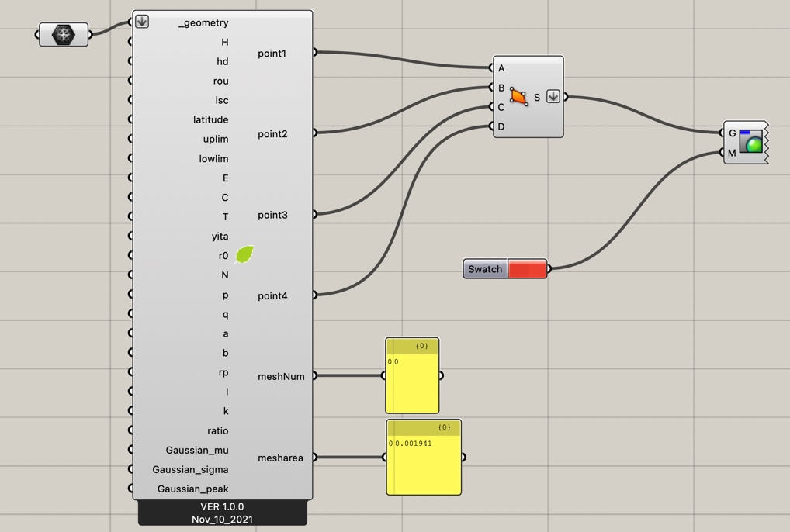
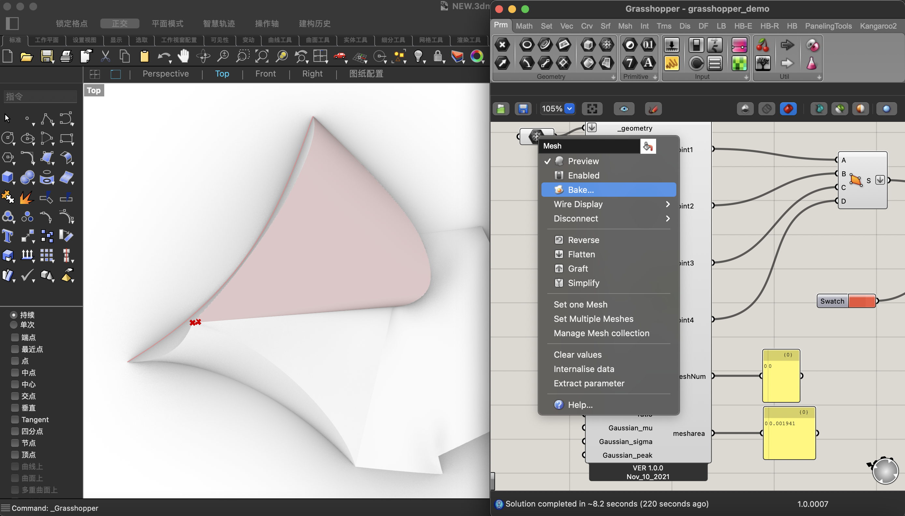
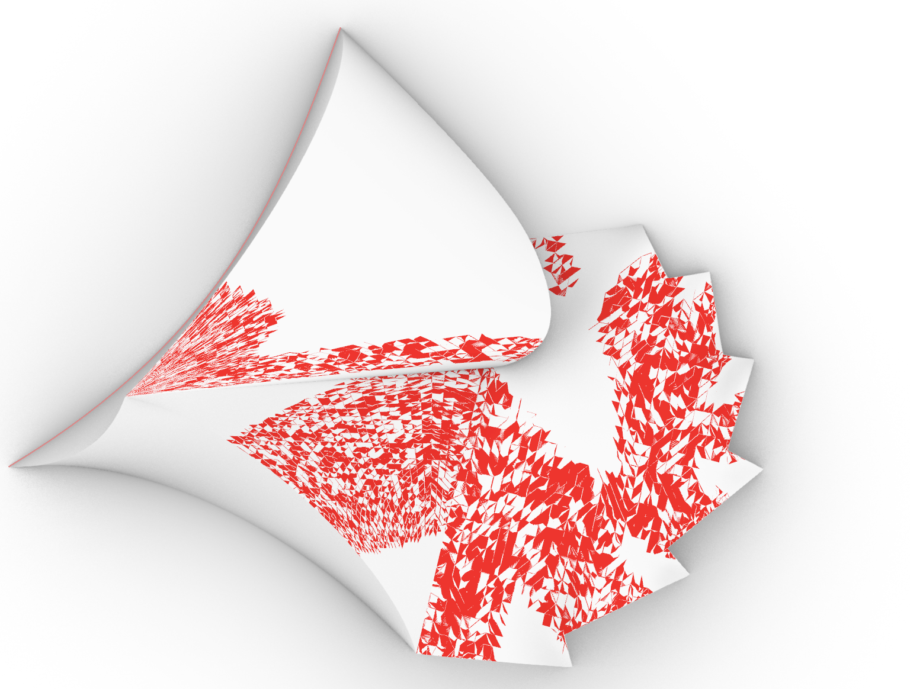

# A systematic design method for green buildings based on the combined system of flexible solar cells and reactors on buildings

\[[paper](https://doi.org/10.1016/j.buildenv.2021.108657)\]

## introduction 
The article proposes a model that comprehensively considers ecological and economic benefits
This plug-in is the implementation of the model in the article, as well as the data analysis part of article.

In order to interact with the building model, it is implemented as a plug-in in the grasshopper platform in Rhino, which is a commonly used CAD.

You can use it by opening the demo file directly in the grasshopper platform[MaterialInstallation v1.0.0](https://github.com/conver334/MaterialInstallation/releases/tag/v1.0.0)

## platform

Grasshopper for Rhino 6 for Win
Grasshopper for Rhino 7 for Win
Grasshopper for Rhino 6 Mac
Grasshopper for Rhino 7 Mac

## how to use

### quick start
1. Open the demo file in grasshopper[MaterialInstallation v1.0.0](https://github.com/conver334/MaterialInstallation/releases/tag/v1.0.0)

2. Use Mesh cells to select faces in your Rhino file to analyze

3. View the results in the currently open Rhino file

### make your own cell
Copy the main.py code to the GH_python script component in the grasshopper platform
Adjust according to your needs

## Datasets
The parameters in the demo file are set to Guangzhou by default

You can get other locale parameters from the EPW repository at [ladybug](https://github.com/ladybug-tools/ladybug). Download from here[EPWMap](https://www.ladybug.tools/epwmap/).