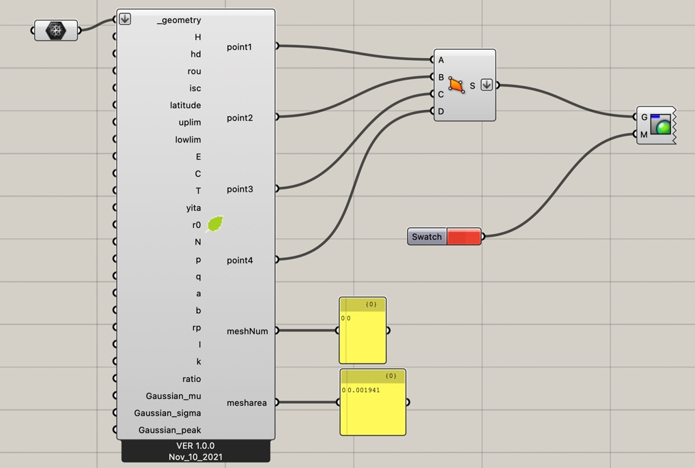
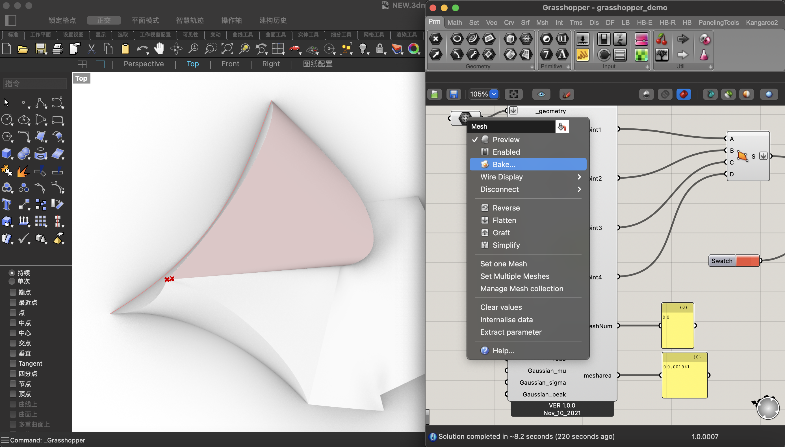

# A systematic design method for green buildings based on the combined system of flexible solar cells and reactors on buildings

\[[paper](https://doi.org/10.1016/j.buildenv.2021.108657)\]

## introduction 

文章中提出了综合考虑生态和经济效益的模型

该插件为文章中的模型的实现，以及文章中的数据分析部分代码

为了能够方便与建筑模型交互，实现为常用的CAD软件Rhino里的grasshopper平台里的插件

可以直接在grasshopper平台中打开演示文件使用[MaterialInstallation v1.0.0](https://github.com/conver334/MaterialInstallation/releases/tag/v1.0.0)

## platform

Grasshopper for Rhino 6 for Win

Grasshopper for Rhino 7 for Win

Grasshopper for Rhino 6 Mac

Grasshopper for Rhino 7 Mac

## how to use

### quick start
1. 在grasshopper中打开演示文件[MaterialInstallation v1.0.0](https://github.com/conver334/MaterialInstallation/releases/tag/v1.0.0)

2. 用Mesh电池选择你的Rhino文件中要分析的面

3. 在当前打开的Rhino文件中查看结果

### make your own cell
复制main.py代码至grasshopper平台中的GH_python script 组件

根据自己需要调整

## Datasets
演示文件中参数默认设置为广州地区

你可以从[ladybug](https://github.com/ladybug-tools/ladybug)的EPW库中获得其他地区参数. 从此处下载[EPWMap](https://www.ladybug.tools/epwmap/).